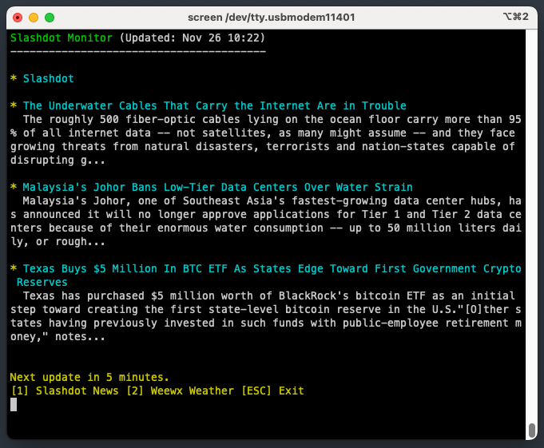

# Home Monitor - RSS Feed Reader

This program fetches and displays RSS feeds on your RP6502 Picocomputer. It currently supports a local WeeWX weather station and the SlashdotThis program fetches and displays RSS feeds on your RP6502 Picocomputer. It supports local weather stations (WeeWX) and internet news feeds via a lightweight proxy.



It functions as a "Dashboard," automatically refreshing every 5 minutes and formatting the output with ANSI colors for readability.

## Features

- **Configurable Feeds**: Load up to 10 different feeds via a text file on the USB drive.
- **HTTPS Support**: Access secure feeds (CBC, BBC, etc.) using the included Python proxy.
- **Dashboard Display**: Parses RSS data to display organized summaries (Weather Conditions vs News Headlines).
- **ANSI Graphics**: Formats output with colors (Cyan, Yellow, Green, White) and decodes HTML entities (e.g., degree symbols).
- **Auto-Refresh**: Updates data automatically every 5 minutes.
- **Keyboard Control**: 
  - **[1-9]**: Switch between loaded feeds.
  - **[ESC]**: Exit program.

## Prerequisites

### 1. WiFi Configuration
Before running this program, you need to configure WiFi on your RP6502-RIA-W:

```text
SET SSID your_network_name
SET PASS your_network_password
SET RF 1
STATUS
```

### 2. HTTPS Proxy (Required for News Feeds)
The RP6502 cannot directly connect to HTTPS (SSL) websites. To access feeds like CBC or BBC, you must run a lightweight Python script on a computer or Raspberry Pi on your local network.

*   **Script:** `rss_proxy.py` (included in this repo).
*   **Installation:** See **[rss_proxy.md](rss_proxy.md)** for instructions on setting this up as a background service.

## Configuration (`feeds.txt`)

You must create a file named `feeds.txt` and place it on your USB drive in the same folder as the program.

**Format:** Pipe-separated values (`|`).
```text
Type|Name|Host|Port|Path|StartTag|EndTag|SkipFirst
```

**Column Definitions:**
1.  **Type**: `0` for Weather (special formatting), `1` for News (List view).
2.  **Name**: Display name for the header.
3.  **Host**: The hostname or IP address.
4.  **Port**: `80` for HTTP, `8080` (or custom) for your Python Proxy.
5.  **Path**: URL path to the RSS feed.
6.  **StartTag**: XML tag to find (usually `<description>` for weather, `<title>` for news).
7.  **EndTag**: Closing XML tag.
8.  **SkipFirst**: `1` to skip the first item (usually the Channel Title), `0` to keep it.

**Example `feeds.txt`:**
```text
# Weather (Local HTTP)
0|Weewx|weatherpi.home.arpa|80|/weewx/rss.xml|<description>|</description>|0
# News (Direct HTTP)
1|Slashdot|rss.slashdot.org|80|/Slashdot/slashdot|<title>|</title>|1
# News (Via Python Proxy)
1|CBC News|192.168.1.50|8080|/cbc|<title>|</title>|1
1|BBC News|192.168.1.50|8080|/bbc|<title>|</title>|1
```

## Building

```bash
cd /Users/rowe/home_monitor/home_monitor
cmake --build build
```

This produces `build/homemonitor.rp6502` ready to run on your RP6502.

## Running

1. Copy **`build/homemonitor.rp6502`** to your USB drive.
2. Copy **`feeds.txt`** to the same location on the USB drive.
3. From the RP6502 monitor:
   ```
   load homemonitor.rp6502  
   reset  
   ```

## How It Works

1. **Modem Initialization**: Opens the `AT:` device and resets the modem emulator (`ATZ`, `ATE0`).
2. **TCP Connection**: Uses the Hayes command `ATDhostname:port` to open a raw TCP stream to the server.
3. **HTTP Request**: Sends a `GET` request with `Connection: close`.
4. **Data Retrieval**: Uses the standard library `read()` function (Kernel Block Read) to pull data into a 16KB global buffer. This is significantly faster than stack-based operations.
5. **Parsing & Filtering**:
   - Scans for specific tags (`<description>` for weather, `<title>` for news).
   - Filters out unwanted metadata (e.g., channel descriptions).
   - Decodes HTML entities (like `&#176;` for degrees).
6. **Input Handling**: Maps the USB HID keyboard state to XRAM address `0x8000`. The program directly reads the RIA hardware registers to detect key presses without blocking the update timer.

## Customization

To add or modify feeds, edit the `FeedConfig` structures in `src/main.c`:

```c
FeedConfig feed_custom = { 
    2,                  /* ID */
    "My Feed",          /* Display Name */
    "example.com",      /* Host */
    "80",               /* Port */
    "/rss.xml",         /* Path */
    "<title>",          /* Start Tag */
    "</title>",         /* End Tag */
    1                   /* Skip first item? (1=Yes) */
};
```

## Technical Details

- **Memory Management**: Uses a **16KB global buffer** to ensure full HTTP headers and RSS bodies are captured.
- **Keyboard Mapping**: The keyboard state is mapped to XRAM address **0x8000** to avoid collisions with Video RAM and the System Stack.
- **ANSI Codes**: Uses standard ANSI escape codes for screen clearing and text coloring.
- **Word Wrapping**: Implements custom logic to handle 80-column wrapping and UTF-8 multibyte characters (Smart Quotes, Em Dashes).

## Troubleshooting

*   **"Error: Could not open feeds.txt"**: Ensure the file exists on the USB drive and is in the current directory.
*   **"No RSS items found"**:
    *   If using a direct link, the server might be forcing HTTPS. Use the Proxy.
    *   Check your `StartTag` and `EndTag` in `feeds.txt`.
*   **"Connection Failed"**:
    *   Verify the IP address in `feeds.txt`.
    *   If using the proxy, check that the firewall on the Pi allows port 8080.

## References

- [RP6502-RIA-W Documentation](https://picocomputer.github.io/ria_w.html)
- [WeeWX Weather Software](https://weewx.com/)